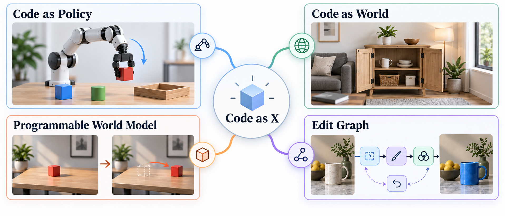

# Awesome Code as Policy/World/Editor

**把程序当作中间表示的 coding agent。**  

  

[English](README.md) | [中文](README.zh.md) | [中文解读](https://mp.weixin.qq.com/s/MuOz0KmmQa5CxzjY7WEEvA)

<table align="center">
  <tr>
    <td align="center" width="35%">
      
       
      社区由<strong>sourcemind</strong>支持
    </td>
    <td align="center" width="35%">
      
       
      微信群二维码
    </td>
  </tr>
</table>

## Overview
- 🎯 [目标](#目标)
- 📚 [Policy Program 定义](#policy-program-定义) | [World Program 定义](#world-program-定义) | [Programmable World Model 定义](#programmable-world-model-定义) | [Edit Graph 定义](#edit-graph-定义) | [Benchmark 定义](#benchmark-定义)

**Code as Policy**
- 🦾 [Code as Policy](#code-as-policy)

**Code as World**
- 🗺️ [Code as World](#code-as-world)

**Programmable World Models**
- 🧮 [Programmable World Models](#programmable-world-models)

**Edit Graphs**
- ✂️ [Edit Graph](#edit-graph)

**Benchmarks**
- 📊 [Benchmark](#benchmark)

## 目标
agent 写出或改好程序、工具图或可检查的世界状态，再交给仿真器、渲染器、机器人或编辑器去跑。应用场景包括：机器人策略、可执行场景、可编程世界模型、图像和视频编辑图，以及评测这些 agent 的 benchmark。

有新论文会继续加。欢迎补充。

## Policy Program 定义
Code-as-Policy 用 LLM / VLM 当高层 agent，写出可执行的机器人程序，或者一层很薄的语义动作接口，用来替代 VLA 动作 token。这个说法来自 Code as Policies。

- [⭐️] **Code as Policies**: Language Model Programs for Embodied Control.  

## World Program 定义
World program 是可执行的场景或物理程序，比如 Blender、MuJoCo、USD、CadQuery，不是静态 mesh，也不是视频。从语言或布局写出来叫生成；从图像、视频或扫描写回去叫反演。

- [⭐️] **SceneCode**: Executable World Programs for Editable Indoor Scenes with Articulated Objects.  

## Programmable World Model 定义
可编程世界模型把状态和转移写在代码里。生成模型或渲染器只管外观。

- [⭐️] **Code World Model**: Coding Agent as World Brain.  

## Edit Graph 定义
编辑图是一次可检查、可回滚的修改：工具调用序列、视觉程序，或时间线补丁。VisProg 是比较早的例子。

- [⭐️] **VisProg**, Visual Programming: Compositional Visual Reasoning Without Training. 

## Benchmark 定义
这类 benchmark 测的是 coding agent 能不能写出、跑通、改好机器人学习或可执行世界相关的程序。

- [⭐️] **RLE-Bench**: A Qualifying Exam for Coding Agents as Robot Learning Engineers. 

## Code as Policy

- [⭐️] **Code as Policies**: Language Model Programs for Embodied Control.  

- [⭐️] **CaP-X**: A Framework for Benchmarking and Improving Coding Agents for Robot Manipulation.  

- [⭐️] **RATs**, Playful Agentic Robot Learning.  

- [⭐️] **Show-Harness**: Just a VLM Agent Can Play Robots.  

- **GPT-Policy**: In-Context Robot Learning with VLM Agents. 

- **GPT-as-Policy**: GPT 6 Astra as an Embodied Policy. 

- **VLCP**, Vision Language Control Policy: Closed-Loop Code Replanning for Robot Manipulation. 

- **RHO**, Your Coding Agent is Secretly a Roboticist. 

- **ALRM**, Agentic LLM for Robotic Manipulation.  

- **Act-Observe-Rewrite**, Multimodal Coding Agents as In-Context Policy Learners for Robot Manipulation. 

- **HyCodePolicy**, Hybrid Language Controllers for Multimodal Monitoring and Decision in Embodied Agents. 

- **ModuLoop**, Low-Level Code Generation using Modular Synthesizer and Closed-Loop Debugger for Robotic Control. 

- **NeSyRo**, Towards Reliable Code-as-Policies: A Neuro-Symbolic Framework for Embodied Task Planning. 

- **RoboPro**, Robotic Programmer: Video Instructed Policy Code Generation for Robotic Manipulation.  

- **ProgPrompt**: Generating Situated Robot Task Plans using Large Language Models. 

- **VoxPoser**: Composable 3D Value Maps for Robotic Manipulation with Language Models.  

- **Instruct2Act**: Mapping Multi-modality Instructions to Robotic Actions with Large Language Model. 

- **Language to Rewards** for Robotic Skill Synthesis. 

- **Demo2Code**: From Summarizing Demonstrations to Synthesizing Code via Extended Chain-of-Thought. 

- **Voyager**: An Open-Ended Embodied Agent with Large Language Models. 

## Code as World

### Generation

- [⭐️] **SceneCode**: Executable World Programs for Editable Indoor Scenes with Articulated Objects.  

- [⭐️] **VideoCoCo**: Code-as-CoT for Physically-Consistent Video Generation via an Agentic Dual-Engine System.  

- **Code-as-Room**: Generating 3D Rooms from Top-Down View Images via Agentic Code Synthesis.  

- **RoomWright**, Beyond Placement and Articulation: Usage-Driven Code Scenes for Embodied Interaction. 

- **SR-Platform**: An Agentic Pipeline for Natural Language-Driven Robot Simulation Environment Synthesis. 

- **GS-Agent**: Creating 4D Physical Worlds With Generative Simulation.  

- **SceneCraft**: An LLM Agent for Synthesizing 3D Scenes as Blender Code. 

- **3D-GPT**: Procedural 3D Modeling with Large Language Models. 

- **LL3M**: Large Language 3D Modelers. 

### Inversion / Reconstruction

- [⭐️] **NeoWorld-Pro**: Programming Interactive Scenes from Monocular Images for Embodied Simulation.  

- [⭐️] **Code as Worlds**: Agentic Discovery of Executable World Representations for Physical Reasoning.  

- **VIGA**, Vision-as-Inverse-Graphics Agent via Interleaved Multimodal Reasoning.  

- **Thinking in Blender**: Staged Executable Inverse Graphics with Vision-Language Models. 

- **RCWM**, Recursive Code World Models: Building Complex Worlds through Recursive Scene Programs. 

- **VisPhyWorld**: Probing Physical Reasoning via Code-Driven Video Reconstruction.  

- [⭐️] **LiteReality-Agent**: An Agentic System for Interactable 3D Indoor Scene Reconstruction. 

## Programmable World Models

- [⭐️] **Code World Model**: Coding Agent as World Brain.  

- [⭐️] **Programmable World Model**.  

- **PoE-World**: Compositional World Modeling with Products of Programmatic Experts.  

- **PatchWorld**: Gradient-Free Optimization of Executable World Models for Agent Environments.  

- **Mind-Studio**: Executable World Models with Lookahead Evaluation for Partially Observable Games.  

- **CWM-GGP**, Code World Models for General Game Playing. 

- **Web World Models**.  

- **gWorld**, Generative Visual Code Mobile World Models.  

- **WorldCoder**: Building World Models by Writing Code and Interacting with the Environment. 

- **GIF-MCTS**, Generating Code World Models with Large Language Models Guided by Monte Carlo Tree Search. 

## Edit Graph

- [⭐️] **VisProg**, Visual Programming: Compositional Visual Reasoning Without Training. 

- [⭐️] **IEAP**, Image Editing As Programs with Diffusion Models.  

- [⭐️] **EditDuet**: A Multi-Agent System for Video Non-Linear Editing.  

- [⭐️] **VideoAgent**: All-in-One Framework for Video Understanding and Editing.  

- **CoSTA\***: Cost-Sensitive Toolpath Agent for Multi-turn Image Editing.  

- **FaSTA\***: Fast-Slow Toolpath Agent with Subroutine Mining for Efficient Multi-turn Image Editing.  

- **Lego-Edit**: A General Image Editing Framework with Model-Level Bricks and MLLM Builder.  

- **CanvasAgent**: Enabling Complex Image Creation and Editing via Visual Tool Orchestration.  

- **IMAGAgent**: Orchestrating Multi-Turn Image Editing via Constraint-Aware Planning and Reflection.  

- **RefineCut**, Plans You Can Check: Verifier-Grounded Learning of an Open-Weight Planner for Executable Video-Editing.  

## Benchmark

- [⭐️] **RLE-Bench**: A Qualifying Exam for Coding Agents as Robot Learning Engineers. 

- **WorldCoder-Bench**: Evaluating Executable Three.js Worlds. 

