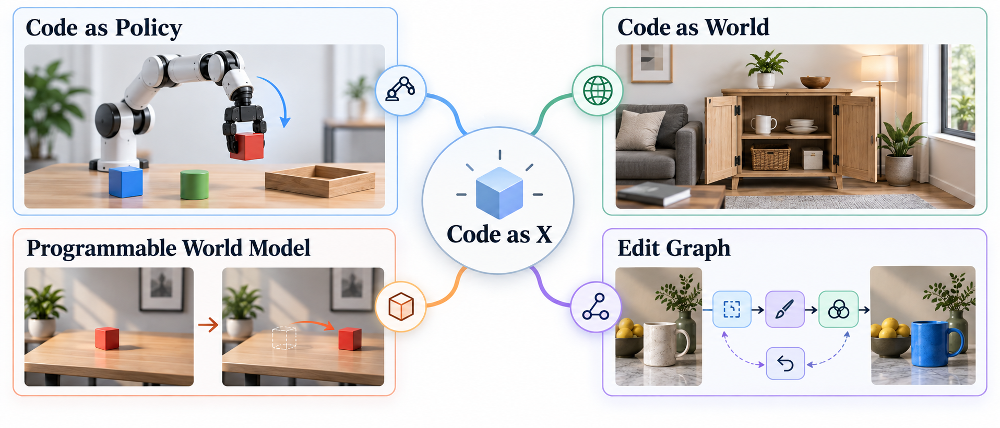

# Awesome Code as Policy/World/Editor

**把程序当作中间表示的 coding agent。**  

  

[English](README.md) | [中文](README.zh.md) | [HF Blog](https://huggingface.co/blog/kkakkkka/from-coding-agents-to-physical-agents) | [中文解读](https://mp.weixin.qq.com/s/MuOz0KmmQa5CxzjY7WEEvA)

<table align="center">
  <tr>
    <td align="center" width="35%">
      
       
      社区由<strong>sourcemind</strong>支持
    </td>
    <td align="center" width="35%">
      
       
      微信群二维码
    </td>
  </tr>
</table>

## Overview
- 🎯 [目标](#目标)
- 📚 [Policy Program 定义](#policy-program-定义) | [World Program 定义](#world-program-定义) | [Programmable World Model 定义](#programmable-world-model-定义) | [Edit Graph 定义](#edit-graph-定义) | [Benchmark 定义](#benchmark-定义) | [Project 定义](#project-定义)

**Code as Policy**
- 🦾 [Code as Policy](#code-as-policy)

**Code as World**
- 🗺️ [Code as World](#code-as-world)

**Programmable World Models**
- 🧮 [Programmable World Models](#programmable-world-models)

**Edit Graphs**
- ✂️ [Edit Graph](#edit-graph)

**Benchmarks**
- 📊 [Benchmark](#benchmark)

**Projects**
- 🛠️ [Projects](#projects)
    - [评测报告](#评测报告)
    - [仿真策略程序](#仿真策略程序)
    - [真机策略程序](#真机策略程序)
    - [规划后调用 VLA](#规划后调用-vla)
    - [从视频反演世界程序](#从视频反演世界程序)
    - [编写 RL 训练栈](#编写-rl-训练栈)

## 目标
agent 写出或改好程序、工具图或可检查的世界状态，再交给仿真器、渲染器、机器人或编辑器去跑。应用场景包括：机器人策略、可执行场景、可编程世界模型、图像和视频编辑图，以及评测这些 agent 的 benchmark。没有论文、但是系统、评测或案例合集的，放进 Projects，不塞进论文栏目。

有新论文和项目会继续加。欢迎补充。

## Policy Program 定义
Code-as-Policy 用 LLM / VLM 当高层 agent，写出可执行的机器人程序，或者一层很薄的语义动作接口，用来替代 VLA 动作 token。这个说法来自 Code as Policies。

- [⭐️] **Code as Policies**: Language Model Programs for Embodied Control.  

## World Program 定义
World program 是可执行的场景或物理程序，比如 Blender、MuJoCo、USD、CadQuery，不是静态 mesh，也不是视频。从语言或布局写出来叫生成；从图像、视频或扫描写回去叫反演。

- [⭐️] **SceneCode**: Executable World Programs for Editable Indoor Scenes with Articulated Objects.  

## Programmable World Model 定义
可编程世界模型把状态和转移写在代码里。生成模型或渲染器只管外观。

- [⭐️] **Code World Model**: Coding Agent as World Brain.  

## Edit Graph 定义
编辑图是一次可检查、可回滚的修改：工具调用序列、视觉程序，或时间线补丁。VisProg 是比较早的例子。

- [⭐️] **VisProg**, Visual Programming: Compositional Visual Reasoning Without Training. 

## Benchmark 定义
这类 benchmark 测的是 coding agent 能不能写出、跑通、改好机器人学习或可执行世界相关的程序。

- [⭐️] **RLE-Bench**: A Qualifying Exam for Coding Agents as Robot Learning Engineers. 

## Project 定义
这里收 X、小红书、只有网页的系统和案例合集，主产物不是论文。agent 可能写机器人程序、世界程序、RL 训练栈，或一层很薄的控制接口。

- [⭐️] **Awesome Astra Embodied AI**: GPT-6 Astra 的具身 / 机器人工作流和 demo。 

## Code as Policy

- [⭐️] **Code as Policies**: Language Model Programs for Embodied Control.  

- [⭐️] **CaP-X**: A Framework for Benchmarking and Improving Coding Agents for Robot Manipulation.  

- [⭐️] **RATs**, Playful Agentic Robot Learning.  

- [⭐️] **Show-Harness**: Just a VLM Agent Can Play Robots.  

- **VLCP**, Vision Language Control Policy: Closed-Loop Code Replanning for Robot Manipulation. 

- **RHO**, Your Coding Agent is Secretly a Roboticist. 

- **ALRM**, Agentic LLM for Robotic Manipulation.  

- **Act-Observe-Rewrite**, Multimodal Coding Agents as In-Context Policy Learners for Robot Manipulation. 

- **HyCodePolicy**, Hybrid Language Controllers for Multimodal Monitoring and Decision in Embodied Agents. 

- **ModuLoop**, Low-Level Code Generation using Modular Synthesizer and Closed-Loop Debugger for Robotic Control. 

- **NeSyRo**, Towards Reliable Code-as-Policies: A Neuro-Symbolic Framework for Embodied Task Planning. 

- **RoboPro**, Robotic Programmer: Video Instructed Policy Code Generation for Robotic Manipulation.  

- **ProgPrompt**: Generating Situated Robot Task Plans using Large Language Models. 

- **VoxPoser**: Composable 3D Value Maps for Robotic Manipulation with Language Models.  

- **Instruct2Act**: Mapping Multi-modality Instructions to Robotic Actions with Large Language Model. 

- **Language to Rewards** for Robotic Skill Synthesis. 

- **Demo2Code**: From Summarizing Demonstrations to Synthesizing Code via Extended Chain-of-Thought. 

- **Voyager**: An Open-Ended Embodied Agent with Large Language Models. 

## Code as World

### Generation

- [⭐️] **SceneCode**: Executable World Programs for Editable Indoor Scenes with Articulated Objects.  

- [⭐️] **VideoCoCo**: Code-as-CoT for Physically-Consistent Video Generation via an Agentic Dual-Engine System.  

- **Code-as-Room**: Generating 3D Rooms from Top-Down View Images via Agentic Code Synthesis.  

- **RoomWright**, Beyond Placement and Articulation: Usage-Driven Code Scenes for Embodied Interaction. 

- **SR-Platform**: An Agentic Pipeline for Natural Language-Driven Robot Simulation Environment Synthesis. 

- **GS-Agent**: Creating 4D Physical Worlds With Generative Simulation.  

- **SceneCraft**: An LLM Agent for Synthesizing 3D Scenes as Blender Code. 

- **3D-GPT**: Procedural 3D Modeling with Large Language Models. 

- **LL3M**: Large Language 3D Modelers. 

### Inversion / Reconstruction

- [⭐️] **NeoWorld-Pro**: Programming Interactive Scenes from Monocular Images for Embodied Simulation.  

- [⭐️] **Code as Worlds**: Agentic Discovery of Executable World Representations for Physical Reasoning.  

- **VIGA**, Vision-as-Inverse-Graphics Agent via Interleaved Multimodal Reasoning.  

- **Thinking in Blender**: Staged Executable Inverse Graphics with Vision-Language Models. 

- **RCWM**, Recursive Code World Models: Building Complex Worlds through Recursive Scene Programs. 

- **VisPhyWorld**: Probing Physical Reasoning via Code-Driven Video Reconstruction.  

- [⭐️] **LiteReality-Agent**: An Agentic System for Interactable 3D Indoor Scene Reconstruction. 

## Programmable World Models

- [⭐️] **Code World Model**: Coding Agent as World Brain.  

- [⭐️] **Programmable World Model**.  

- **PoE-World**: Compositional World Modeling with Products of Programmatic Experts.  

- **PatchWorld**: Gradient-Free Optimization of Executable World Models for Agent Environments.  

- **Mind-Studio**: Executable World Models with Lookahead Evaluation for Partially Observable Games.  

- **CWM-GGP**, Code World Models for General Game Playing. 

- **Web World Models**.  

- **gWorld**, Generative Visual Code Mobile World Models.  

- **WorldCoder**: Building World Models by Writing Code and Interacting with the Environment. 

- **GIF-MCTS**, Generating Code World Models with Large Language Models Guided by Monte Carlo Tree Search. 

## Edit Graph

- [⭐️] **VisProg**, Visual Programming: Compositional Visual Reasoning Without Training. 

- [⭐️] **IEAP**, Image Editing As Programs with Diffusion Models.  

- [⭐️] **EditDuet**: A Multi-Agent System for Video Non-Linear Editing.  

- [⭐️] **VideoAgent**: All-in-One Framework for Video Understanding and Editing.  

- **CoSTA\***: Cost-Sensitive Toolpath Agent for Multi-turn Image Editing.  

- **FaSTA\***: Fast-Slow Toolpath Agent with Subroutine Mining for Efficient Multi-turn Image Editing.  

- **Lego-Edit**: A General Image Editing Framework with Model-Level Bricks and MLLM Builder.  

- **CanvasAgent**: Enabling Complex Image Creation and Editing via Visual Tool Orchestration.  

- **IMAGAgent**: Orchestrating Multi-Turn Image Editing via Constraint-Aware Planning and Reflection.  

- **RefineCut**, Plans You Can Check: Verifier-Grounded Learning of an Open-Weight Planner for Executable Video-Editing.  

## Benchmark

- [⭐️] **RLE-Bench**: A Qualifying Exam for Coding Agents as Robot Learning Engineers. 

- **WorldCoder-Bench**: Evaluating Executable Three.js Worlds. 

## Projects

X、小红书、以及只有网页的系统。论文仍留在上面的栏目。案例合集见 [Awesome Astra Embodied AI](https://github.com/zjwzcx/Awesome-Astra-Embodied-AI)。

- [⭐️] **Awesome Astra Embodied AI**: GPT-6 Astra 的具身工作流案例合集。 

- **GPT-6 Astra**（OpenAI）：这里被当成机器人策略、世界程序编写器和 RL 环境工程师来用。 

### 评测报告

- **GPT-Policy** / **GPT-Policy-Eval**：VLM agent 从一段视频 in-context 学会真机插插头，不用 VLA、RL 或 DAgger。  

- **GPT-as-Policy**，银河通用：公开 benchmark 和报告，把 GPT-6 Astra 当具身策略来打分。  

- **RoboCurve GPT-6 Astra evaluation**：YAM 机械臂上的受控对比；报告碗任务 19/20，输出 token 少 80%。 

### 仿真策略程序

- **Dual-ALOHA 空间约束谜题**（[Qineng Wang](https://x.com/qineng_wang)）：规划 Dual-ALOHA 动作，解开互锁零件，并把绳子穿过三个环。  

- **纯视觉人形控制**（[ZQ](https://www.rednote.com/user/profile/5f20ee17000000000101c247)）：只看相机、不用仿真器特权状态，控制仿真人形。 

- **Isaac Sim 里 G1 捡可乐**（[Flood Sung](https://x.com/RotekSong)）：给 Unitree G1 做高层规划，GEAR-SONIC 跟踪全身 qpos。 

- **四足五关键关节轨迹**（[Akira Sasaki](https://x.com/gclue_akira)）：输出稀疏的五个关节轨迹，底层控制器在 MuJoCo 里跑四足。 

- **SONIC 跟踪的 G1 导航**（[Flood Sung](https://x.com/RotekSong)）：给仿真 G1 做导航规划，GEAR-SONIC 转成全身轨迹。 

- **机械手解魔方**（[Ze Yanjie](https://x.com/ZeYanjie)）：仿真里 zero-shot 灵巧解魔方。 

- **SuperDex 抓苹果柄**（[Kiki Huang](https://www.rednote.com/user/profile/62f72244000000001f0176ea)）：灵巧手在 SuperDex / MuJoCo 里抓住很细的苹果柄。 

- **HumanCLAW-Bench**（[Jiawei Gu](https://x.com/Kuvvius)）：通过 HumanCLAW-Bench harness 完成导航和交互任务。 

- **全身轨迹 + 全身控制器**（[橘子不是唯一的水果](https://www.rednote.com/user/profile/695bb2a2000000003702ea8f)）：写出全身轨迹，全身控制器闭环执行。 

- **一句话 Isaac Sim 抓方块**（[神秘小孙](https://www.rednote.com/user/profile/5b3f9fc86b58b75d4c02ccc0)）：一句任务描述，搭出带深度相机的 Isaac Sim 抓方块 demo。 

- **物理写出斐波那契数列**（[Dmytro Hrybov](https://x.com/dimentary)）：仿真里 G1 做长程写斐波那契，最后给出代码和动作。 

- **桌面操作 LLM harness**（[Jiafei Duan](https://x.com/DJiafei)）：写出并跑通仿真桌面抓放的控制循环。 

### 真机策略程序

- **学打字、自我表达**（[Kaifeng Zhang](https://x.com/kaiwynd)）：开放指令「表达自己」，大约 40 分钟视觉反馈后在真机键盘上打出字。 

- **只从底层控制抓马克笔**（[star大小变](https://www.rednote.com/user/profile/69c2311e000000003203e786)）：没有先验技能，大约 30 分钟摸清关节到末端的控制并抓住马克笔。 

- **移动操作 in-context learning**（[Axel](https://x.com/ax_pey)）：不给任务文本，只靠视觉上下文在不同房间和布局里推断移动操作。 

- **快速适应未见过的本体**（[Lucas Cassiano](https://x.com/lucascassiano)）：在线学会新机器人和 [Vitrus AI](https://x.com/Vitrus_ai) 控制接口，不用人类第一人称数据，也不用 VLA。 

- **ENPIRE harness in-context learning**（[Tonghe Zhang](https://x.com/TongheZhang01)）：通过 ENPIRE harness 做真机 in-context learning，不针对任务重新训练。 

- **Loop-ROS 切黄瓜**（[盒子桥](https://www.rednote.com/user/profile/65bb8b3d000000000d03e137)）：经 Loop-ROS 直接控制真机手臂完成切黄瓜。 

- **画金门大桥**（[thijs](https://x.com/cdngdev)）：给机器人、画笔和相机，把语义提示变成真机笔触，并靠视觉反馈一轮轮改。 

- **直接输出末端位姿**（[Loule](https://www.rednote.com/user/profile/69ddd8920000000033024ad0)）：用第三人称和腕部相机，输出末端位姿，把最长的面包放进篮子。 

- **Piper 抓放胡萝卜**（[虽然不但是](https://www.rednote.com/user/profile/5f5ca72900000000010061fb)）：只用 Codex / GPT-6、Piper 和 RealSense，反复视觉抓放胡萝卜。 

### 规划后调用 VLA

- **经 FluxVLA 做 zero-shot 任务**（[Jikun](https://www.rednote.com/user/profile/5e25bcdc00000000010085a8)）：Astra 负责任务理解和规划，预训练 [FluxVLA](https://github.com/FluxVLA/FluxVLA) 跑底层动作。 

### 从视频反演世界程序

- **实验室厨房重建**（[Frank ZY Dou](https://www.rednote.com/user/profile/5e3431cf0000000001002919)）：20 秒单目 RGB 视频重建带可动柜门的实验室厨房。 

- **绳驱灵巧手重建**（[Dmytro Hrybov](https://x.com/dimentary)）：在 MuJoCo 里复现 1X 腱驱手 demo，腱传动做了简化。 

- **腱驱灵巧手动作重建**（[Jake Fitzgerald](https://x.com/earthtojake)）：设计腱驱手，并在仿真里重建缆线驱动的手指动作。 

- **灵巧手-物体 data rollout**（[Lingxiao](https://x.com/Lingxiao234)）：两段视频做 real-to-sim 重建，再物理重定向到 Wuji 手上，没有显式状态或动作。 

- **Video in → Physics out**（[xiao hu](https://x.com/huxiao93612565)）：给 44 自由度手写手部跟踪、IK 重定向和抓取精修代码。 

- **多视角 real-to-sim**（[Lingxiao](https://x.com/Lingxiao234)）：用多视角 RGB、机器人动作、标定、资产和系统辨识，搭出可回放的 MuJoCo / Blender 仿真。 

### 编写 RL 训练栈

- **Sharpa 手转笔 RL**（[Wentao Zhu](https://x.com/walterzhu8) / Chengyang Li）：大约一天半的自主运行，建笔 mesh、Isaac Lab 任务、PPO 策略和可视化视频。 

- **RL 训练的鸭子机器人**（[拂晓时分_茉莉飘香](https://www.rednote.com/user/profile/5ffbc96d00000000010060ae)）：一张图加一句描述，训出鸭子行走 demo。 

- **四足 RL 运动系统**（[Akira Sasaki](https://x.com/gclue_akira)）：共同设计机器狗，五天 25 轮迭代，用 RL 训出九个仿真动作。 

- **灵巧手掌内操作 RL**（[十一](https://www.rednote.com/user/profile/610bc8f100000000200284e2)）：训练掌内转核桃；报告的这次 run 没开自碰撞。 

- **办公室扫描 → Newton / G1 Gym**（[Jiarui Xu](https://x.com/Jiarui_X)）：把办公室扫描重建进 Blender，导出 USD，在 Newton 里做成 G1 行走场景。 

- **Isaac Sim 环境、PPO 训练和调参**（[十一](https://www.rednote.com/user/profile/610bc8f100000000200284e2)）：一个工作流里搭 Isaac Sim RL 环境、配 PPO、再迭代训练。 

